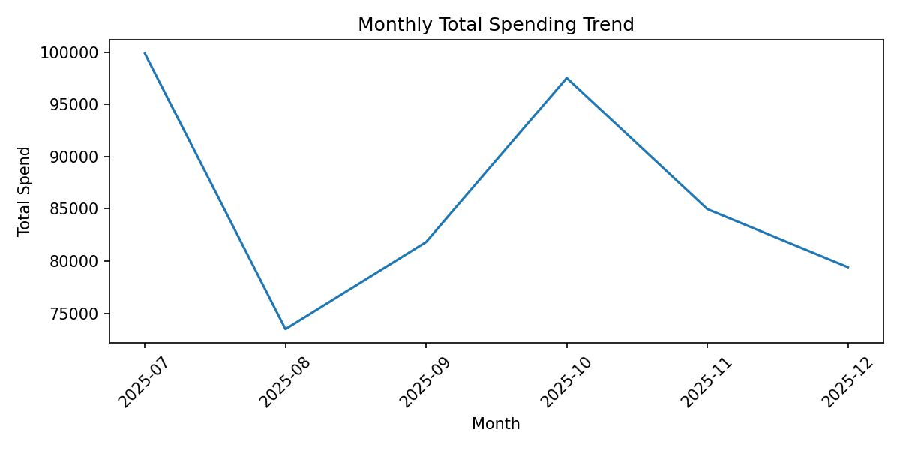

## Sample Visualization

# Personal Finance Expense Analysis (Python & Pandas)

## Overview
This project analyzes personal expense data to understand spending behavior, identify cost drivers, detect high-spend periods, and generate actionable budgeting insights using Python and pandas. The focus is on time-based trends, category-level contributions, and essential vs discretionary spending patterns.

Note: The dataset used in this project is simulated but realistic, designed to reflect real-world personal finance behavior while avoiding privacy concerns.

## Business Questions
- How does total spending vary month over month?
- Which expense categories drive spending volatility?
- What proportion of expenses is essential versus discretionary?
- Are there months with unusually high spending?
- Where can spending be optimized?

## Dataset Description
Time period: 6 months  
Granularity: Transaction-level data  
Key columns:
- date
- category
- sub_category
- amount
- payment_mode
- is_essential

## Tools Used
- Python
- Pandas
- NumPy
- Matplotlib
- Jupyter Notebook

## Analysis Performed
- Data cleaning and validation
- Datetime parsing and feature engineering
- Monthly spending trend analysis
- Category-wise contribution analysis
- Essential vs discretionary spend comparison
- Rolling trend analysis
- Anomaly detection using:
  - Statistical threshold (mean and standard deviation)
  - Percentile-based method (90th percentile)

## Key Insights
- Fixed costs such as Rent and EMI remain stable across months and form a baseline expense.
- Spending volatility is primarily driven by discretionary categories like Shopping and Entertainment.
- Certain months exhibit relatively higher spending due to increases in discretionary expenses rather than essential cost inflation.
- Overall spending remains within a predictable range, indicating controlled financial behavior.

## Recommendations
- Apply spending caps on discretionary categories during high-risk months.
- Monitor rolling monthly spend to identify early overspending signals.
- Focus optimization efforts on variable expenses rather than fixed obligations.

This project demonstrates practical data analysis skills using pandas with an emphasis on business reasoning and real-world applicability.
